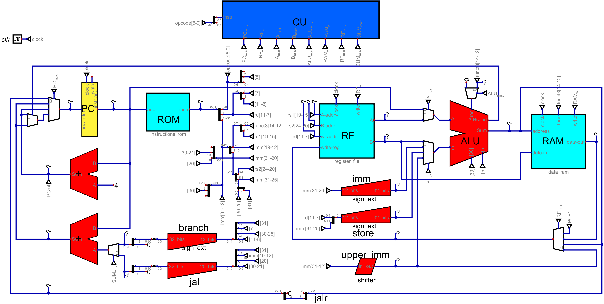
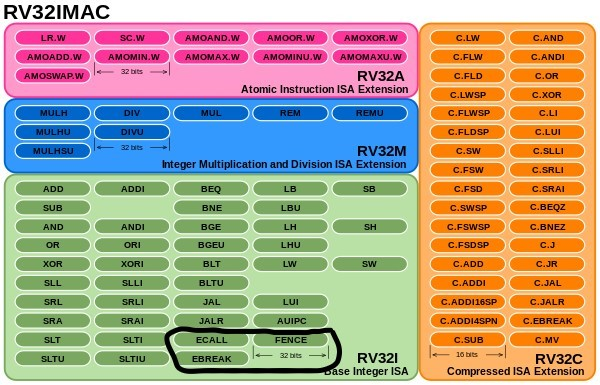
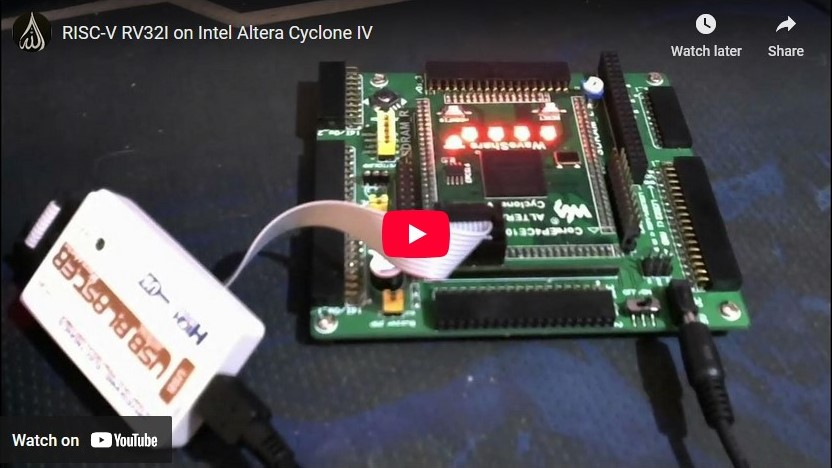
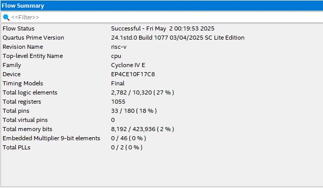

# RISC-V-1C

This Project in 2 words is a project to build a [RISC-V](https://en.wikipedia.org/wiki/RISC-V) processor, a modern and up-to-date processor. Run the simulation on [digital simulation](https://en.wikipedia.org/wiki/Logic_simulation) software. Run several instruction tests and small programs on the simulator. Then transplant it to hardware using a reconfigurable [FPGA](https://en.wikipedia.org/wiki/Field-programmable_gate_array) board.

The simulator in question is called [Digital](https://github.com/hneemann/Digital). It allowed us to do the implementation, to test all the instructions implemented, even to test small programs. But most importantly, it enabled us to generate [Verilog](https://en.wikipedia.org/wiki/Verilog) code, which will then be the medium for transplanting to the FPGA. Normally, hardware implementation is done directly using the Verilog language. But for my part, I preferred visual programming, which makes debugging and testing easier for me. The image below is a snapshot of the entire processor (most of which is the [DataPath](https://en.wikipedia.org/wiki/Datapath)), created using Digital simulator.

## Implementation

Looking at the image at above of the processor, it's easy to see that 90% of the figure represents the processor's DataPath, the rest is the [Control Unit](https://en.wikipedia.org/wiki/Control_unit). The color coding of the processor components is fairly self-explanatory. Light blue is for mass storage, such as [RAM](https://en.wikipedia.org/wiki/Random-access_memory) and [ROM](https://en.wikipedia.org/wiki/Read-only_memory). Dark blue is for the Control Unit. Yellow is for the register, or small memory. Red is for combinatorial circuits, such as the [Arithmetic-Logic Unit](https://en.wikipedia.org/wiki/Arithmetic_logic_unit) or Adders. White is for Multiplexers. Small triangles represent connections that are not drawn, used to avoid cluttering the schematic. The following is a list of processor components:

1.  Control Unit (CU): This is the unit responsible for decoding the instruction, and triggering control signals to control the other DataPath components.
2.  Program Counter (PC): The register containing the address of the instruction currently being executed.
3.  ROM: A read-only memory containing the list of instructions to be executed (the program).
4.  Regiter File (RF): A register bank containing all the programmable registers (32 x 32-bit registers) of the processor.
5.  RAM: The main memory where program data is stored. Accessed by the 2 instructions Store and Load.
6.  Arithmetic and Logic Unit (ALU): This is the unit responsible for all possible arithmetic and logic operations of the processor.
7.  Adders (+): Combinatorial circuits that perform addition, used by the DataPath for address calculation.
8.  Sign expanders (in trapezoid form): Combinatorial circuits for converting integers signed on a reduced number of bits (12 bits, for example) to 32-bit representations.
9.  Shifter (in parallelogram form): Combinatorial circuit for shifting bits.
10.  Multiplexers (in the form of an isosceles trapezoid): Via control signals from the Control Unit, they control the flow of data trough the DataPath.

## Instruction Set Architecture

The [Instruction Set](https://en.wikipedia.org/wiki/Instruction_set_architecture) chosen to be implemented on this processor is the RV32I, with the exception of the 3 instructions ecall, ebreak, and fence, which are not so essential for normal program execution. You can see all the instructions in the diagram below, these are the green instructions, excluding the 3 already mentioned. RISC-V is designed to be flexible enough to include several instruction sets. In our case, we've chosen to implement only the basics. That is, the basic instructions for 32-bit format.

## Verilog generated code

Digital has the ability to automatically generate Verilog or [VHDL](https://en.wikipedia.org/wiki/VHDL) code; in our case, we generated the Verilog code. However, to make the code compatible with the FPGA, some modifications had to be made. The most important of these was a change in the implementation of RAM memory to force the use of the built-in memory blocks, since by default the code didn't use the FPGA's built-in memory blocks called [BRAMs](https://nandland.com/lesson-15-what-is-a-block-ram-bram/); instead RAM was implemented using elementary logic cells. This led to the use of a very high number of logic cells, making the FPGA insufficient to hold the processor. All the Verilog code is contained in [cpu.v](cpu.v).

## FPGA Cyclone IV implementation

An Intel Altera Cyclone IV FPGA was used to implement the processor on hardware. The exact reference of the FPGA is [EP4CE1](https://www.waveshare.com/coreep4ce10.htm), with a frequency of 50 MHz, 164 pins, 10k logic elements, and 50 KB of dedicated memory. To get a glimpse of processor execution on the very fast FPGA, the code has been modified to change the clock frequency from 50 MHz to 1 Hertz. And the first 4 bits of the ALU output are displayed on the 4 LEDs directly integrated into the FPGA. The demonstration video below shows the execution.

The Verilog code was compiled on [Intel Quartus](https://en.wikipedia.org/wiki/Quartus_Prime) Prime Lite edition [EDA](https://en.wikipedia.org/wiki/Electronic_design_automation), and the summary of the compilation result is shown in the following image:

Being inexperienced with FPGAs, I'd like to point out that Google's AI [Gemini 2.5](https://aistudio.google.com), helped me a lot in the FPGA implementation process. I even uploaded the verilog code of the processor design to it, and it managed to find a bug that I didn't detect with the few unit tests I ran.

## Files and directories description

1. cpu.v : The main important file, it was automatically generated by Digital, and contains all the Verilog source code of the processor.
2. Digital circuits files : Is the directory that contains all the Digital logic simulator files of the processor circuit. A design using Digital simulator is organized such that every component of the design is described by a distinct file with the extension .dig. All the files in this directory are structured in a hierarchical structure, embedding each others. The root of the processor design is the file cpu.dig. It should be the file to open by Digital to call the other files, this is the top of the main file of the project. The others are viewed while opening this file, as library components. A listing of all the circuits used by the CPU is enumerated below :
   + cpu.dig
   + program counter.dig
   + Instructions rom.dig
   + register file.dig
   + arethmetic and logic unit.dig
   + data ram.dig
   + ram32bits.dig
   + control unit.dig
   + adder.dig
   + shifter.dig
   + shifter logical left.dig
   + shifter logic arithmetic right.dig
   + sign extender.dig
   + large sign extender.dig

   Many graphical (vector format) files with the extension [.svg](https://en.wikipedia.org/wiki/SVG). have the same name as the circuits. They are graphics used by Digital to depict the external shape of the corresponding circuit.

   The control unit is a combinational circuit, and its the truth tables are described by those 2 files :
     - control unit high.tru
     - control unit low.tru

   Many test units were applied to the processor, the list of those tests with additional information, like the hexadecimal format of the instructions used, are put down in this file :
     + test_ROM.hex
    
3. Quartus Cyclone IV project : The directory containing the FPGA Quartus Cyclone IV project. As said before, [Quartus Prime](https://www.intel.com/content/www/us/en/products/details/fpga/development-tools/quartus-prime.html) version 24.1std, Lite edition was used to compile and synthetize the processor. The FPGA used is the [Intel Altera](https://www.altera.com/) [Cyclone IV](https://www.intel.com/content/www/us/en/programmable/quartushelp/17.0/reference/glossary/def_cycloneiv.htm) [CoreEP4CE10](https://www.waveshare.com/coreep4ce10.htm), shipped by [waveshare](https://www.waveshare.com). The exact reference of the FPGA chip is EP4CE10F17C8N. The CoreEP4CE10 was attached to the [DVK600](https://www.waveshare.com/dvk600.htm) development board, shipped also by waveshare. Almost all the files in this directory are automatically generated by the compilation process. But some files are essential to understand, while carrying on the compilation process. The description of these files is as follows :
   + risc-v.qpf : is the main project file, to open by Quartus.
   + cpu.v : is the Verilog source file generated by Digital, describing the processor.
   + risc-v.qsf : is the constraint file, the file used to map the top entity inputs/outputs with the pins of the FPGA. The only mandatory pin in our implementation is the **clock** pin. The modification of this file is easier to modify it using Quartus tools.
   + output_files/risc-v.sof : is the bit-stream file, or the configuration file. The file to upload using [JTAG](https://en.wikipedia.org/wiki/JTAG) port, on the memory (SRAM), used to confgure the CPU on the FPGA.
  
4. images : A directory containing the images used in this readme text.
  
## Website link
The website of the autor of this project, that contains many other similar projects : https://www.el-kalam.com/
     

